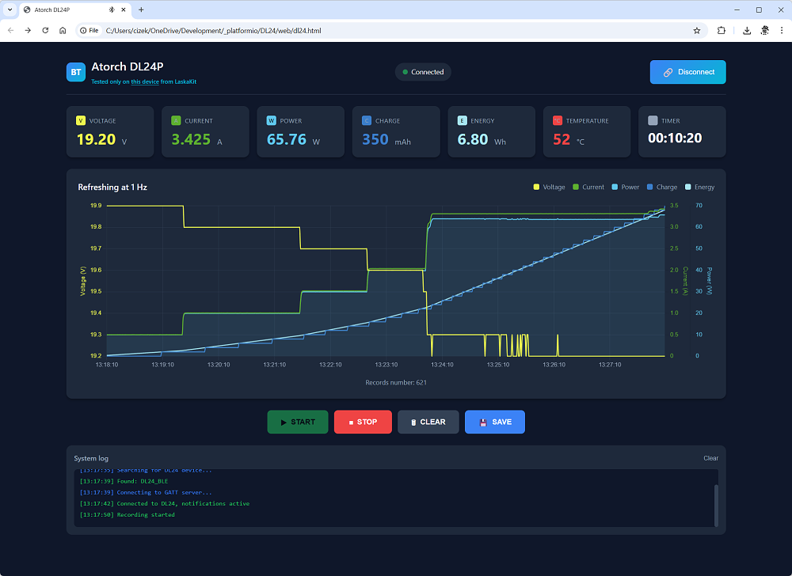

# Atorch DL24P Bluetooth Dashboard

A simple web-based dashboard for monitoring Atorch DL24P electronic load via Web Bluetooth API.

## Features

- Real-time display of voltage, current, power, charge (mAh), energy (Wh), and temperature
- Live chart with multiple data series (voltage, current, power, charge, energy)
- Active load control (ON/OFF) via Atorch protocol
- Data recording with start/stop control (START also turns load ON, STOP turns it OFF)
- Export recorded data to CSV
- Dark theme UI optimized for lab use

## Tested Device

This dashboard has been tested only with:

**ATORCH DL24P Laboratory Electronic Load 200V, 25A, 180W**
Purchased from [LaskaKit](https://www.laskakit.cz/atorch-dl24p-laboratorni-elektronicka-zatez-200v--25a--180w/)

Other Atorch devices may or may not work.

## Limitations

- **Partial protocol support** - The DL24P implements only a subset of the Atorch communication protocol. Some fields documented in the protocol specification do not work as expected with this device.
- **Toggle-based control** - Load ON/OFF uses a toggle command (Atorch `0x32` = OK button simulation), not explicit on/off states. The dashboard assumes the load is off when you click START and on when you click STOP.

## Protocol Reference

The Bluetooth communication protocol was inspired by the specification at:
https://github.com/syssi/esphome-atorch-dl24/blob/main/docs/protocol-design.md

Note that DL24P only partially implements this protocol.

## Browser Compatibility

This dashboard uses the Web Bluetooth API, which is supported in:

- Google Chrome (desktop and Android)
- Microsoft Edge
- Opera

**Not supported:** Firefox, Safari, iOS browsers

## Usage

1. Open `dl24.html` in a compatible browser
2. Click "Connect Bluetooth" and select your DL24P device
3. The dashboard will display live measurements
4. Click "START" to turn the load ON and begin recording data
5. Click "STOP" to turn the load OFF and stop recording
6. Click "SAVE" to export recorded data as CSV
7. Click "CLEAR" to reset all recorded data

## Development

This project was largely developed with the assistance of **Claude Code (Opus 4.6)** AI chatbot.

For easy extension via vibe coding with LLMs, see [`Claude.md`](./Claude.md) - a technical specification describing the internal architecture, data structures, and extension points.
